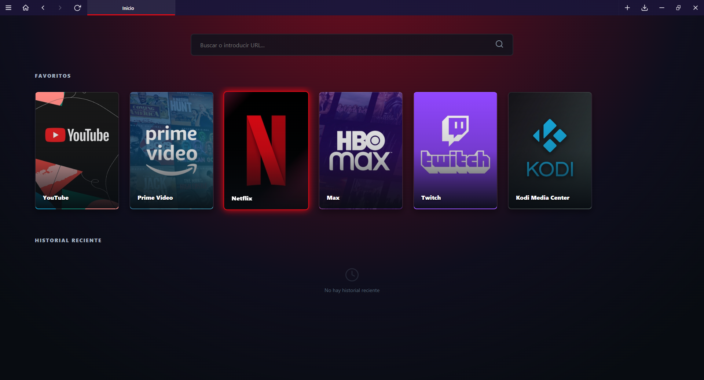
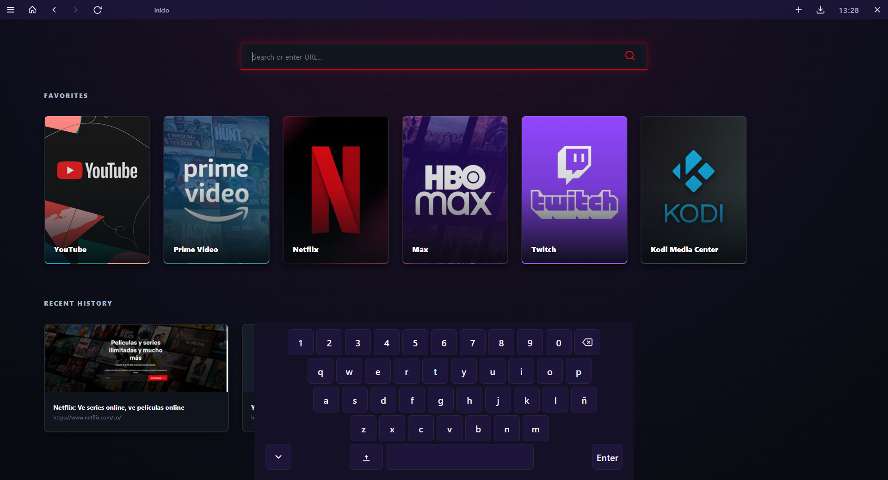

#  PadBrowser

A TV-friendly browser built with Electron, designed for Xbox/PlayStation gamepad navigation.






## Features

- **Gamepad navigation** — Full Xbox/PlayStation controller support with virtual pointer (left stick), D-pad element navigation, and button shortcuts
- **Virtual keyboard** — On-screen QWERTY keyboard with Caps Lock, backspace, space, and enter — designed for controller-only input
- **Tab system** — Create, close, and switch between multiple tabs with a visual tab bar
- **URL bar** — Search bar with autocomplete suggestions and URL input
- **Steam-inspired home page** — Favorites carousel with cover art, recent history with page thumbnails, and a Netflix-style animated search bar
- **Settings** — Console mode, virtual keyboard toggle, download folder picker, controls guide, language switcher (ES/EN), and quit
- **Downloads manager** — Real-time progress tracking, open files, badge counter on toolbar, clear list
- **Interactive tutorial** — Visual controller diagram with button mappings and animated guides
- **Opera GX / Netflix dark theme** — Custom frameless window with red/dark color scheme, animated loading spinner, and smooth transitions
- **Favorites** — Add or remove sites from the home page carousel
- **Bilingual UI** — Full Spanish and English localization
- **Navigation controls** — Back, forward, reload, and home buttons
- **Page thumbnails** — Automatic screenshot captures for browsing history
- **Download safety dialog** — Warns before closing with active downloads
- **Keyboard shortcuts** — Configurable shortcuts for quick actions

## Controls (gamepad)

| Button   | Action                 |
|----------|------------------------|
| LT       | Close tab              |
| LB       | Previous tab           |
| LS       | Click / Move pointer   |
| DPAD     | Navigate elements      |
| RT       | New tab                |
| RB       | Next tab               |
| A        | Click                  |
| B        | Back                   |
| X        | Forward                |
| Y        | Open URL               |
| RS       | Smooth scroll          |

## Build

```bash
npm install
npm run build          # build for current platform
npm run pack:win       # package for Windows (.exe)
npm run pack:linux     # package for Linux (.AppImage/.deb)
```

## License

MIT
