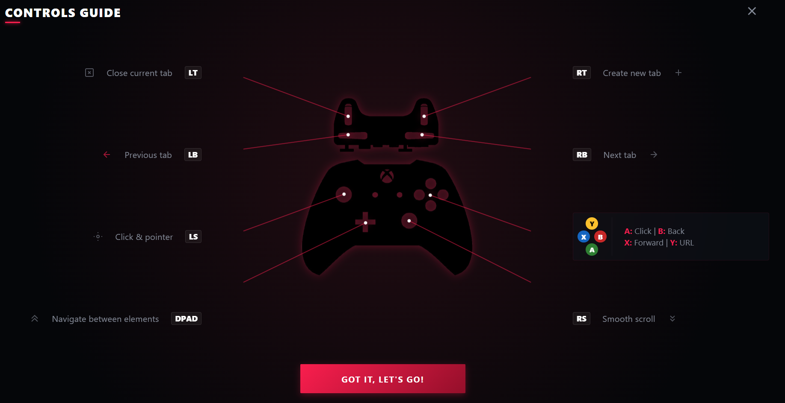

#  PadBrowser

A TV-friendly browser built with Electron, designed for Xbox/PlayStation gamepad navigation.



## Features

- Full gamepad navigation (LS pointer, RT/LT tabs, etc.)
- Opera GX-inspired UI with red/dark theme
- Tabs, history, downloads
- Configurable keyboard and gamepad shortcuts

## Controls (gamepad)

| Button   | Action                 |
|----------|------------------------|
| LT       | Close tab              |
| LB       | Previous tab           |
| LS       | Click / Move pointer   |
| DPAD     | Navigate elements      |
| RT       | New tab                |
| RB       | Next tab               |
| A        | Click                  |
| B        | Back                   |
| X        | Forward                |
| Y        | Open URL               |
| RS       | Smooth scroll          |

## Build

```bash
npm install
npm run build          # build for current platform
npm run pack:win       # package for Windows (.exe)
npm run pack:linux     # package for Linux (.AppImage/.deb)
```

## License

MIT
